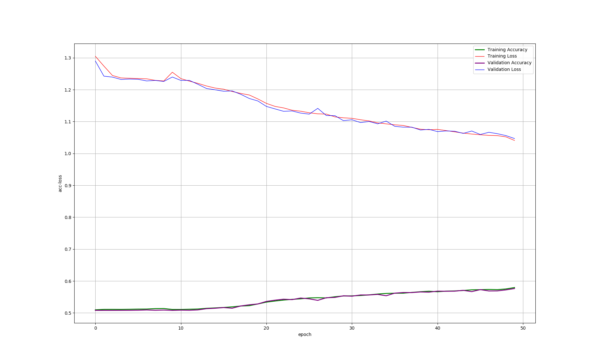

# SentimentAnalysisOnMovieReviews
Kaggle竞赛题目[Sentiment Analysis on Movie Reviews](https://www.kaggle.com/c/sentiment-analysis-on-movie-reviews)多种机器学习和深度学习算法实现

## 1. 不同实现方法的得分
以下各种实现方法的得分是针对相应代码中的参数和网络结构设计的情况下的得分, **此处不表示各种算法本身的性能对比**

| 实现方法 | Score | 迭代次数(采用early stopping)近似值 | 说明 |
| :--- | :---: | :---: | :--- |
| **LSTM v1.0** | 0.58319 | 50(从下面的loss-acc曲线可以看出并没有收敛, underfitting) | 采用word2vec([GoogleNews-vectors-negative300.bin](https://github.com/3Top/word2vec-api)), 没有考虑PhraseId和SentenceId, 训练集中重复样本没有去重 |
| **LSTM v2.0** |  | 300 | 同v1.0，仅增加迭代次数 |

## 2. 关于预处理
拿到数据首先应该做的就是预处理, 包括一些数据统计工作, 例如**统计样本的数据分布情况(label是否分布均匀)**, **查看样本数据缺失值的情况(并填补缺失值)**, **标准化&归一化**, **to_categorical**, **reshape**, **train_test_split**, **数据扩充(data augmentation)**, **特征提取**, **特征选择**, **降维**等

## 3. LSTM实现方法结果绘制
1. 迭代次数只取50次的loss和accuracy曲线如下图所示:
   
 从图中我们可以看出训练集和验证集上的accuracy都还在提高，loss都还在下降，说明模型参数还可以继续迭代优化以提升模型预测效果

## TODO
train_wo_sw.csv应该去重，再生成train_vector.csv
