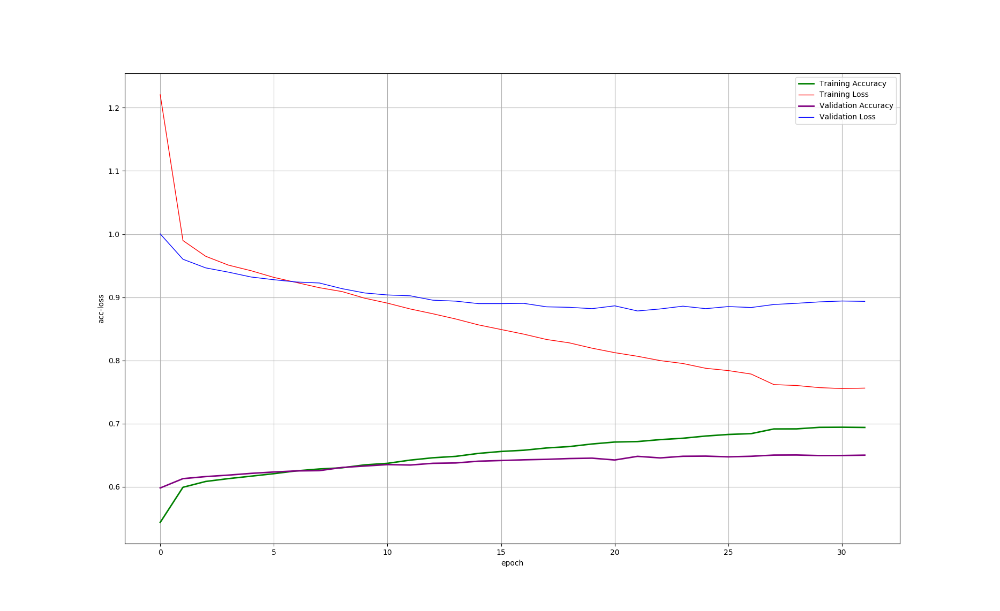

# SentimentAnalysisOnMovieReviews
Kaggle竞赛题目[Sentiment Analysis on Movie Reviews](https://www.kaggle.com/c/sentiment-analysis-on-movie-reviews)多种算法实现

## 1. 不同实现方法的得分
以下各种实现方法的得分是针对相应代码中的参数和网络结构设计的情况下的得分, **此处不表示各种算法本身的性能和效果对比**

| 实现方法 | Score | 迭代次数(采用early stopping)近似值 | batch_size | 说明 |
| :------ | :---: | :---: | :---: | :------ |
| **LSTM v1.0** | 0.58319 | 50(从下面的loss-acc曲线可以看出并没有收敛, underfitting) | 512 | 采用word2vec([GoogleNews-vectors-negative300.bin](https://github.com/3Top/word2vec-api)), 没有考虑PhraseId和SentenceId, 使用词向量的均值作为句子的向量, 训练集中重复样本没有去重 |
| **LSTM v2.0** | 0.58399 | 69 | 512 | 与v1.0区别: 增加EarlyStopping、 ReduceLROnPlateau、ModelCheckpoint |
| **LSTM v3.0** | 0.56919 | 66 | 512 | 与v2.0区别: 去除了训练集中的重复样本 |
| **LSTM v3.1** | 0.57120 | 142 | 1024 | 与v2.0区别: 去除了训练集中的重复样本、增加batch_size |
| **LSTM v4.0** | 0.51789 | 5(初始化时落到局部极小值了?) | 1024 | 与v2.0区别: 增加batch_size |
| **LSTM v4.1** | **0.58642** | 106 | 1024 | 与v2.0区别: 增加batch_size、更改随机数种子 |
| **LSTM v5.0** | **0.** |  | 1024 | 与v4.1区别: 1. 更改Phrase词向量的表示形式(使用矩阵，而不是所有词向量的平均值) |
| **LSTM v5.1** | **0.62831** | 22 | 1024 | 与v4.1区别: 1. 更改Phrase词向量的表示形式(使用矩阵，而不是所有词向量的平均值) 2. 所有单词转换为小写取词向量 |
| **Random Forest** |  | / | / | sklearn |

## 2. 关于预处理
拿到数据首先应该做的就是预处理, 包括一些数据统计工作, 例如**统计样本的数据分布情况(label是否分布均匀)**, **查看样本数据缺失值的情况(并填补缺失值)**, **数据扩充(data augmentation)**, **特征提取**, **特征选择**, **标准化&归一化**, **降维**, **to_categorical**, **train_test_split**, **reshape**等

## 3. LSTM实现方法结果绘制
1. v1.0: 迭代次数(epochs)取50时的loss和accuracy曲线如下图所示:  
 ![docs/images/[with_dup]ep50_bs512_v1.0.png](docs/images/[with_dup]ep50_bs512_v1.0.png)  
 从图中我们可以看出训练集和验证集上的accuracy都还在提高, loss都还在下降, 说明模型参数还可以继续迭代优化, 以提升模型预测效果
2. v2.0: 与v1.0区别 增加EarlyStopping、ReduceLROnPlateau、ModelCheckpoint, 对应的loss和accuracy曲线如下图所示(具体参数取值参见[with_LSTM.py文件中的设置](https://github.com/lxw0109/SentimentAnalysisOnMovieReviews/blob/master/src/with_LSTM.py)):  
 ![docs/images/[with_dup]ep69_bs512_v2.0.png](docs/images/[with_dup]ep69_bs512_v2.0.png)  
 从图中我们可以看出验证集上的accuracy在接近70次迭代时不再提高, loss也不再下降, 说明模型基本已训练完成，继续迭代可能会导致过拟合.
3. v3.0: 与v2.0区别 去除了训练集中的重复样本, 对应的loss和accuracy曲线如下图所示:  
 ![docs/images/[wo_dup]ep66_bs512_v3.0.png](docs/images/[wo_dup]ep66_bs512_v3.0.png)  
 从图中我们可以看出:  
 + 去除重复样本时(v3.0)，第一次迭代后训练集和验证集上的准确率就比未去除重复样本的情况(v2.0)的低(v2.0首次迭代后准确率高于50%, 而v3.0的仅有46%左右). 经多次实验发现，去除训练集中的重复样本进行训练时就会出现这一现象.
 + 去除重复样本的情况(v3.0)，整个曲线变化比未去除重复样本的情况(v2.0)要变化的慢(准确率提升的慢)
4. v3.1: 与v2.0区别 去除了训练集中的重复样本、增加batch_size, 对应的loss和accuracy曲线如下图所示:  
 ![docs/images/[wo_dup]ep142_bs1024_v3.1.png](docs/images/[wo_dup]ep142_bs1024_v3.1.png)  
 从图中我们可以看出:   
 + 训练集和验证集上的loss在超过100次迭代后下降的速度非常慢, 模型基本已训练完成.
 + 本项目去除训练集重复样本后，针对batch_size取16/32/64/128/256/512/1024都进行了测试，准确率提升得比未去除训练集重复样本的速度都要慢(第一次迭代的准确率就低了4个百分点左右. Don't know why? 可能是数据集的原因?)
5. v4.1(v4.0略): 与v2.0区别 增加batch_size、更改随机数种子, 对应的loss和accuracy曲线如下图所示:  
 ![docs/images/[with_dup]ep106_bs1024_v4.1.png](docs/images/[with_dup]ep106_bs1024_v4.1.png)  
 从图中我们可以看出:  
 + 与v3.1的accuracy曲线对比, 可以看出去除训练集中的重复样本的训练准确率提升的非常慢(v3.1 acc曲线)，在迭代50次后仍低于55%，而未去除重复训练样本的训练(v4.1)准确率提升的要快得多，迭代50次后，训练集和验证集上的准确率都已经明显超过了55%
 + 对比v3.1和v4.1训练得到的模型，在测试集上的准确率得分(Kaggle给出的评分)，可以看出训练集中重复样本没有去重的准确略比去重后的准确率要高(Don't know why? 数据集的原因?)
6. v5.0: 与v4.1区别 更改Phrase词向量的表示形式(使用矩阵，而不是所有词向量的平均值), 对应的loss和accuracy曲线如下图所示:  

7. v5.1: 与v4.1区别 更改Phrase词向量的表示形式(使用矩阵，而不是所有词向量的平均值)且所有单词转换为小写取词向量, 对应的loss和accuracy曲线如下图所示:  
   
 使用矩阵表示句子, 而不是使用句子中所有单词词向量的平均值表示句子后, 我们可以看出:
 + 模型的**准确率有了显著地提升**
 + 模型的**训练速度和收敛速度明显提升**，只需28分钟左右，而v1.0-v4.1需要8小时左右(**十几倍的速度提升**); v5.1只需22次迭代即达到收敛, 而v2.0-v3.0需要近70次迭代，v4.1需要100多次迭代才能收敛

 
 
## TODO
1. 所有字母全部转为小写字母，再获取词向量
